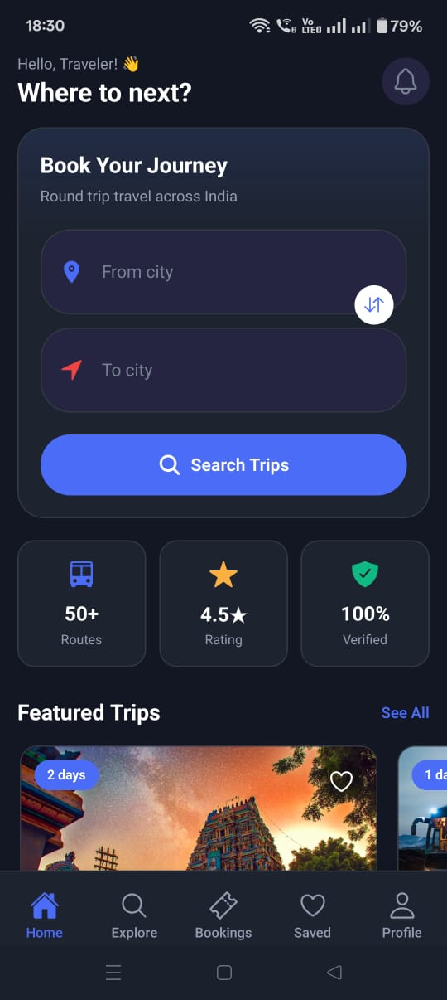
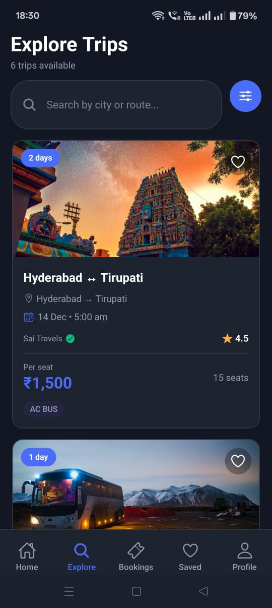
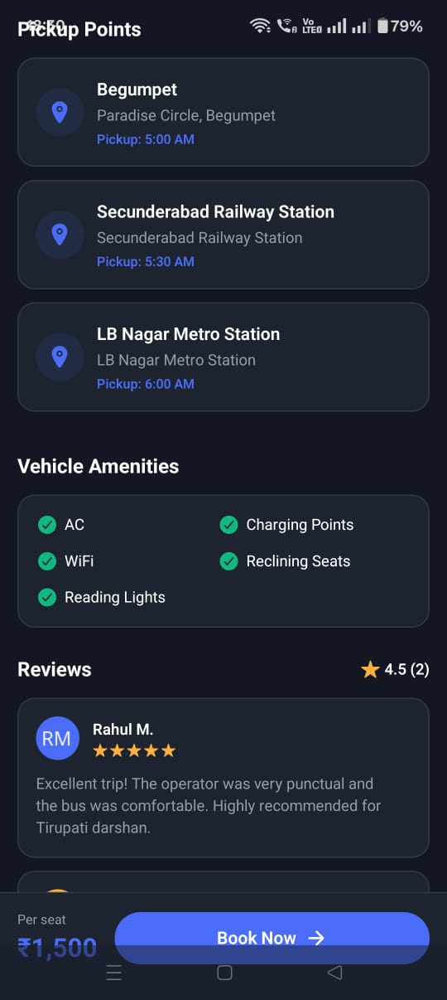
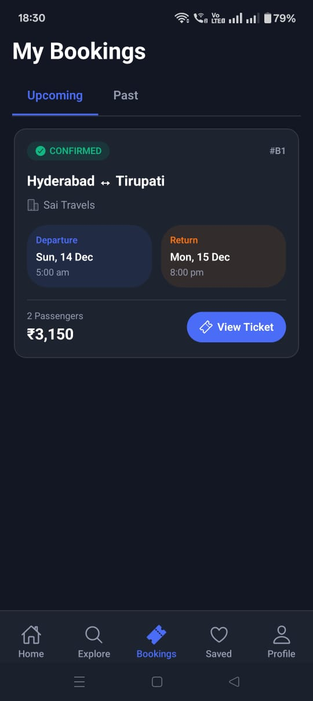
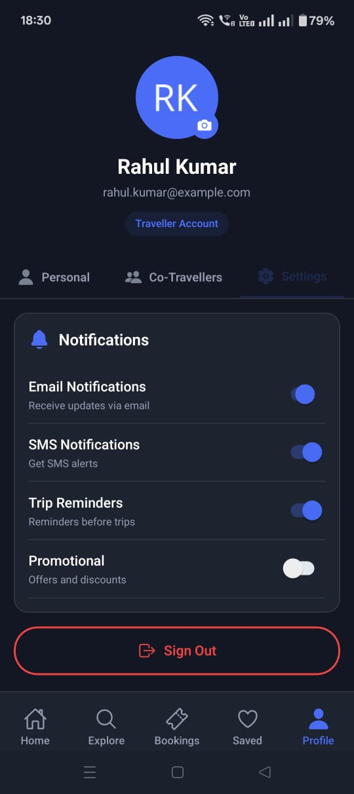

# Travel Mobile App - Screen Showcase

A cross-platform mobile application for travel bookings built with **React Native** and **Expo**, featuring offline support, push notifications, and a seamless booking experience.

## 📱 App Screenshots

### Home Screen
The landing page with featured trips, popular destinations, and quick search functionality.

---

### Explore Trips
Browse and discover available trips with filters, sorting options, and detailed trip cards.

---

### Trip Details
Comprehensive trip information including pricing, amenities, schedule, and booking options.

---

### Pickup Points
Interactive map and list view of all pickup/drop locations for easy navigation.

---

### Bookings
View and manage all your trip bookings with status tracking and ticket details.

---

### Profile
User profile management with booking history, preferences, and account settings.

---

## 🛠️ Tech Stack

- **React Native** - Cross-platform mobile framework
- **Expo** - Development and build toolchain
- **TypeScript** - Type-safe development
- **GraphQL** - API queries and mutations
- **Apollo Client** - State management and caching

## ✨ Features

- 🔍 Real-time trip search and filtering
- 📍 Interactive pickup point selection
- 💳 Secure payment integration
- 📱 Push notifications for booking updates
- 📴 Offline support for booked trips
- 🎫 Digital ticket with QR code

## 👨‍💻 Developer

**Srinivas Thadigoppula**  
Software Architect | Full Stack Developer

📧 srivasu1428@gmail.com

---

*Part of the Travel Booking Platform ecosystem*
